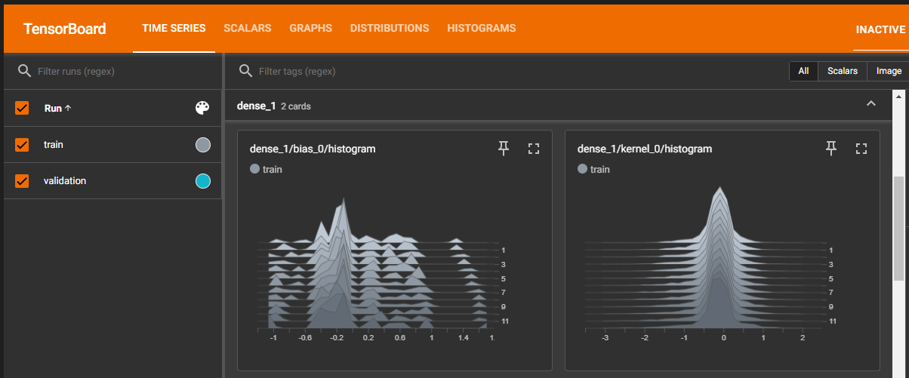
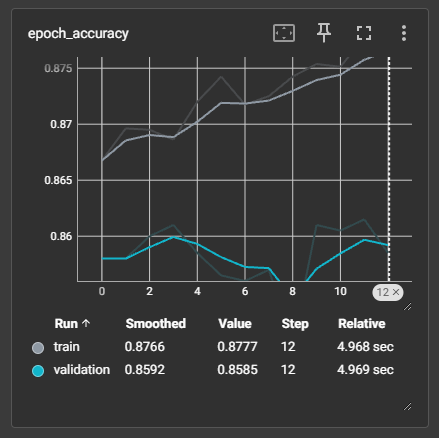
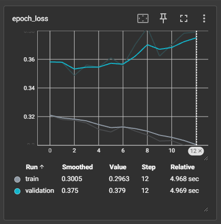

# Customer Churn Prediction using Deep Learning
This project presents a deep learning workflow to predict customer churn in the banking sector using an Artificial Neural Network (ANN) built with TensorFlow and deployed via a Streamlit web interface. The model estimates churn probability based on customer demographics and account-level features, enabling businesses to proactively identify customers likely to churn and take retention measures.


## Project Objective
Customer churn presents a major challenge in banking and subscription based services, leading to revenue loss and reduced lifetime value. This project aims to build a predictive model that classifies whether a customer is likely to churn based on historical behavioral and demographic data. The goal is to integrate this model into an interactive app for real time churn risk prediction.


## Key Components
- A fully connected **Artificial Neural Network (ANN)** designed using TensorFlow and Keras
- Data preprocessing pipeline with feature encoding and normalization 
- **Model performance monitoring** via TensorBoard
- Interactive **Streamlit web application** for real time predictions
- Serialized model and preprocessing objects for deployment


## Dataset
The model is trained on the [churn modelling dataset](https://www.kaggle.com/datasets/shrutimechlearn/churn-modelling), which contains historical data of bank customers including:

- **Customer demographics**: Age, Gender, Geography
- **Account metrics**: Balance, Credit Score, Number of Products
- **Activity flags**: Has Credit Card, Is Active Member
- **Target feature**: `Exited` (1 = churned, 0 = retained)


## Model Architecture
- **Input Layer**: 10 features
- **Hidden Layers**: 2 dense layers with ReLU activation
- **Output Layer**: i unit with Sigmoid activation for binary classification
- **Loss Function**: Binary Crossentropy
- **Optimizer**: Adam
- **Epochs**: 13 *(early stopping applied)*


## Model Performance Summary
Training metrics logged using TensorBoard:

Metric              | Final Value
--------------------|--------------
Training Accuracy   | ~87.7%  
Validation Accuracy | ~85.8%   
Training Loss       | ~0.30    
Validation Loss     | ~0.38   

- The model shows **strong generalization** with minimal overfitting  
- Training and validation accuracies are closely aligned (~2% gap)  


## Key TensorBoard Visualizations
Model training is tracked using TensorBoard to analyze learning progress and detect overfitting

### 1. **Kernel & Bias Weight Distributions**


- Histograms for all **Dense** layers show **well-behaved weight transitions**
- No evidence of vanishing/exploding gradients, confirming **stable learning**

### 2. **Training vs Validation Accuracy**


- Shows consistent accuracy gain over epochs
- Validation accuracy stabilizes around **85.8%**

### 3. **Training vs Validation Loss**


- Training loss declines steadily, indicating consistent learning
- Validation loss plateaus and remains relatively stable, with minor fluctuations observed toward the later stages of training


## Setup Instructions
1. Clone the repository:
```bash
git clone https://github.com/your-username/churn-prediction-app-ANN.git
cd churn-prediction-app-ANN
```

2. Create virtual environment:
```bash
conda create -p venv python=3.11 -y
conda activate ./venv
```

3. Install dependencies:
```bash
pip install -r requirements.txt
```

4. Run the app:
```bash
streamlit run app.py
```

## License
MIT License

## Author
**Sanjay Narendra**  
Feel free to reach out via [LinkedIn](https://www.linkedin.com/in/sanjay-narendra-427255170/) for questions or collaborations.